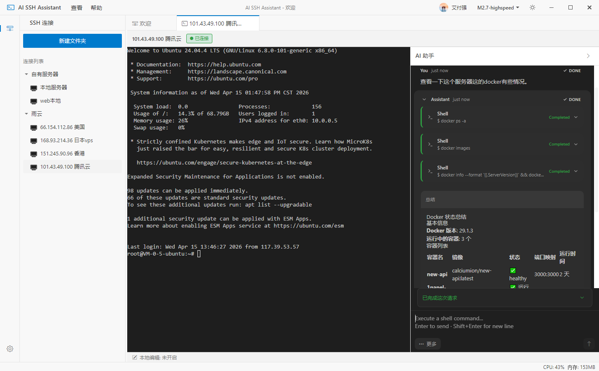
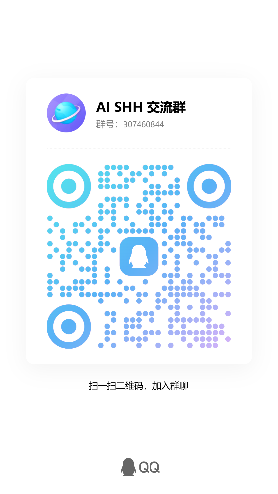

  <h1>AI SSH Assistant</h1>
  

    <strong>基于 AI 的智能 SSH 远程服务器管理助手</strong>
  

  
通过自然语言对话，轻松管理您的远程服务器

  
  

    
    
    
    
  

---

## ✨ 特性亮点

- 🤖 **AI 智能对话** - 使用自然语言与服务器交互，AI 自动生成并执行命令
- 🔗 **SSH 连接管理** - 安全管理多个远程服务器连接，支持密码和私钥认证
- 💻 **实时终端** - 基于 xterm.js 的完整终端模拟器，支持所有 SSH 功能
- 📁 **文件管理** - 可视化的远程文件浏览和 SFTP 文件传输
- 🔒 **安全可靠** - SSH 凭据与配置信息保存在本地，降低云端泄露风险
- 🎨 **现代化 UI** - 仿 VS Code 的美观界面，支持亮色/暗色主题
- 💾 **本地存储** - SSH 连接、密钥和相关配置仅保存在本地设备
- 🌐 **多 AI 平台** - 支持 OpenAI、Anthropic、Google Gemini、Ollama、通义千问等
- 📱 **跨平台** - 完整支持 Windows、macOS 和 Linux 系统

## 📸 应用演示

  
  
<em>AI SSH Assistant 最新界面展示</em>

## 🚀 快速开始

### 📦 下载安装包（推荐）

请前往
**[Releases 页面](https://github.com/aifuqiang02/ai-ssh-assistant/releases/latest)**
下载最新版本。

## 📚 使用指南

### 登录后开始使用

1. 启动应用后，先登录账号
2. 在左侧边栏创建 SSH 连接
3. 在设置中配置您的 AI 服务提供商
4. 开始与您的服务器对话

> 当前版本只有本地存储一种方式。登录是使用软件的必要步骤，但 SSH 连接、私钥和相关配置仍以本地保存为主，不默认做云端同步。

### 订阅说明

- 项目代码开源，桌面软件为持续运营的付费产品
- 基础功能套餐：`2 元 / 月`
- AI 套餐：`3 元 / 月` 每月 `1000` 次，工具多次调用不重复计次，平均每次约
  `0.003` 元

桌面软件采用低门槛订阅制，用于支持持续维护、体验优化、问题修复和长期更新。

### 为什么值得支持

- 您支付的不只是一个安装包，而是在支持一个持续打磨体验的工具
- 低门槛订阅可以帮助项目长期更新，而不是发布后停在原地
- 对独立开发者来说，稳定而克制的收入，才能换来更长期、更认真、更负责的维护

如果这个工具确实帮您省下了时间、减少了重复操作，愿意订阅支持，就是在帮助一个认真做产品的人把这件事继续做好。

### AI 配置

应用支持多种 AI 平台：

- **OpenAI** - GPT-3.5/GPT-4
- **Anthropic** - Claude 3 系列
- **Google** - Gemini Pro
- **Ollama** - 本地运行的开源模型
- **通义千问** - 阿里云大模型
- **其他** - DeepSeek、月之暗面等

您可以在"设置 → AI 配置"中添加自己的 API
Key 使用；如果使用 AI 套餐，则按套餐内提供的 AI 额度为准，具体能力范围以软件内说明为准。

## 🤝 问题反馈

如果您在使用过程中遇到 Bug，或对产品功能有改进建议，欢迎在
[Issues](https://github.com/aifuqiang02/ai-ssh-assistant/issues) 页面提交反馈。

---

## 💬 加入社区

欢迎加入 QQ 交流群，与其他用户交流使用经验、分享技巧、反馈问题！

如需提交 Bug 或功能建议，建议优先使用 `Issues`；QQ 群更适合日常交流和使用讨论。

  
  

    <strong>AI SSH 交流群</strong> 
    QQ 群号：<code>307460844</code> 
    <a href="https://qm.qq.com/q/etLhGujyzm">点击加入群聊</a>
  

---

## ❓ 常见问题

如何配置 AI 服务？

在应用中点击"设置 → AI 配置"，添加您的 API
Key。支持多个 AI 平台，推荐使用 Anthropic Claude 或 OpenAI GPT-4。

数据存储在哪里？

- SSH 连接、私钥和相关配置默认保存在本地设备
- 当前版本不提供配置自动云端同步，优先保证数据可控与本地安全

为什么软件需要登录和付费？

- 项目代码开源，但桌面软件以持续运营的产品方式维护
- 登录用于识别订阅状态并保障服务可持续，不等于把敏感配置全部上传云端
- 订阅价格保持在较低水平，希望让更多用户愿意长期支持独立开发

支持哪些操作系统？

完整支持 Windows 10/11、macOS (Intel + Apple Silicon) 和 Linux
(Ubuntu/Debian/AppImage)。

数据安全吗？

- SSH 密码和私钥使用加密存储
- 所有数据传输使用 HTTPS/WSS
- 支持本地存储模式，数据完全在本地
- 开源代码，可审计

## 📎 更多信息

- 更新日志：[CHANGELOG.md](./CHANGELOG.md)
- 开源协议：[MIT License](./LICENSE)
- 项目地址：[GitHub Repository](https://github.com/aifuqiang02/ai-ssh-assistant)

---

  
如果这个项目对您有帮助，欢迎给个 ⭐️ Star；如果这个产品对您有价值，也欢迎订阅支持。

  
Made with ❤️ by <a href="https://github.com/aifuqiang02">aifuqiang</a>

