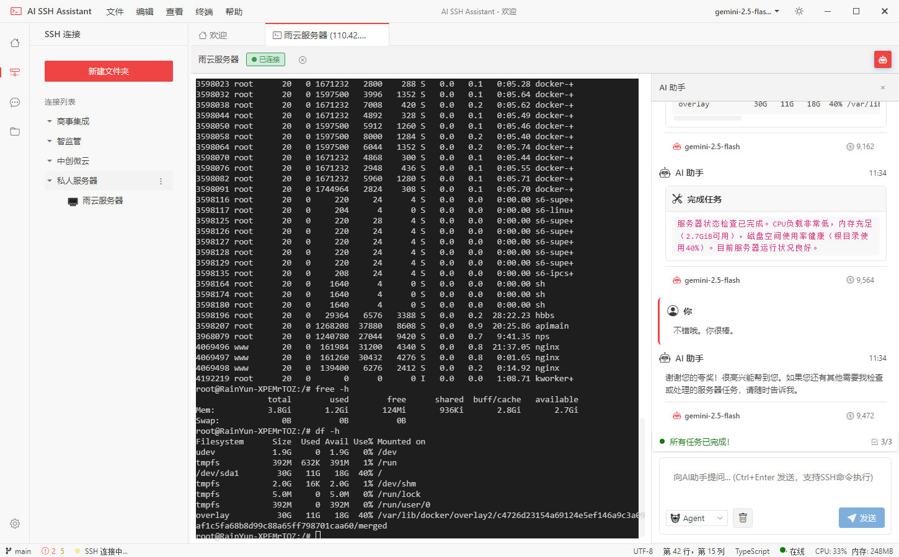

# 从 0 到 1 打造终端智能补全：AI 助力效率翻倍的开发实战

> 让终端像 IDE 一样智能：自动补全 + AI 建议 + 历史命令 = 极致开发体验



## 🎯 前言

**问题引入**（开门见山，直击痛点）

你是否遇到过这些问题：
- 在终端输入 `cd` 想进入某个目录，却记不清目录名？需要先 `ls` 看一下
- 执行 Git 命令时，总要手动输入分支名、文件路径，容易出错
- 经常重复执行相同的命令，需要翻找历史记录（Ctrl+R）
- 在 `/var/www/` 目录下输入 `cd`，补全却提示 `/root` 的内容？

这些都是我在开发 AI SSH Assistant 时遇到的真实问题。作为一个远程服务器管理工具，终端是核心功能，用户体验直接决定产品的成败。

**本文将讨论**
- 如何实现一个完整的终端自动补全系统
- 如何集成 AI 智能建议，让补全更懂用户意图
- 如何解决路径补全、命令执行等实战问题
- 如何优化 UI/UX，打造类似 VSCode 的极致体验

**预计阅读时间**：15 分钟

---

## 📖 第一部分：背景与技术挑战

### 为什么需要终端自动补全？

**现状分析**

传统的终端工具（如 PuTTY、SecureCRT）虽然提供了基本的命令执行功能，但在自动补全方面往往力不从心：
- **原生 Tab 补全**：只能在服务器端生效，Web 终端无法直接使用
- **路径补全**：需要手动输入或复制粘贴，效率低下
- **命令参数**：记不住复杂的选项和参数，需要查文档
- **重复操作**：频繁执行的命令没有快速访问方式

**用户需求**

在我发布 AI SSH Assistant v1.0 后，收到了大量用户反馈：
- "能不能像 VSCode 一样，输入 `cd` 就提示所有目录？"
- "Git 命令参数太多了，能不能自动提示？"
- "我经常忘记之前执行过的命令，能不能显示历史记录？"
- "AI 能不能根据我的操作习惯，推荐下一步要执行的命令？"

这些需求促使我下定决心：**打造一个智能化的终端补全系统**。

### 技术挑战

实现一个完整的终端补全系统，面临以下技术挑战：

| 挑战 | 难点 | 影响 |
|------|------|------|
| **上下文感知** | 如何准确获取当前目录、输入内容、光标位置？ | 补全准确性 |
| **路径解析** | 如何处理绝对路径、相对路径、`~`、`..` 等？ | 功能完整性 |
| **性能优化** | 如何在 SSH 远程执行命令获取数据时保持流畅？ | 用户体验 |
| **AI 集成** | 如何让 AI 理解用户意图并提供有价值的建议？ | 智能化程度 |
| **UI/UX 设计** | 如何设计一个不干扰用户、但又随时可用的补全弹窗？ | 易用性 |
| **边界情况** | 如何处理特殊字符、权限错误、网络延迟等？ | 稳定性 |

---

## 📖 第二部分：系统架构设计

### 整体架构

```
┌─────────────────────────────────────────────────────────────┐
│                     Terminal Component                       │
│  (xterm.js + 用户输入监听)                                    │
└──────────────────┬──────────────────────────────────────────┘
                   │ 监听输入事件
                   ↓
┌─────────────────────────────────────────────────────────────┐
│              useTerminalAutocomplete                         │
│  - 提取当前行和目录                                          │
│  - 防抖处理(300ms)                                           │
│  - 键盘导航(↑↓ Tab Enter Esc)                                │
│  - 光标位置计算                                              │
└──────────────────┬──────────────────────────────────────────┘
                   │ 调用补全引擎
                   ↓
┌─────────────────────────────────────────────────────────────┐
│               AutocompleteEngine                             │
│  - 解析命令上下文(command, tokens, cursor)                   │
│  - 匹配命令规范(cd, ls, git, npm, docker...)                 │
│  - 合并多个补全源                                            │
│  - 过滤、排序、去重                                          │
└──────────────────┬──────────────────────────────────────────┘
                   │ 调用各个补全源
                   ↓
┌─────────────────────────────────────────────────────────────┐
│                   Completion Sources                         │
│  ┌──────────┬──────────┬──────────┬──────────┬──────────┐  │
│  │ 命令规范 │ AI 建议  │ 历史命令 │ 别名     │ 环境变量 │  │
│  │ (Specs)  │ (AI)     │ (History)│ (Alias)  │ (Env)    │  │
│  └──────────┴──────────┴──────────┴──────────┴──────────┘  │
└──────────────────┬──────────────────────────────────────────┘
                   │ SSH 远程执行
                   ↓
┌─────────────────────────────────────────────────────────────┐
│                    SSH Client                                │
│  - client.exec("ls /var/www")                                │
│  - client.exec("git branch -a")                              │
│  - client.exec("npm run --silent")                           │
└─────────────────────────────────────────────────────────────┘
```

### 核心技术栈

**前端层**:
- **Vue 3** - 响应式 UI 框架
- **TypeScript** - 类型安全
- **xterm.js** - 终端模拟器
- **Composables** - 逻辑复用

**通信层**:
- **Electron IPC** - 主进程与渲染进程通信
- **ssh2** - SSH 协议实现

**AI 层**:
- **ChatCompletion API** - 统一的 AI 接口
- **支持多个提供商** - OpenAI、Anthropic、Google 等

---

## 📖 第三部分：核心功能实现

### 1. 上下文提取：从终端缓冲区读取当前状态

**挑战**：如何从 xterm.js 的缓冲区中准确提取当前输入的命令和工作目录？

**解决方案**：

```typescript
function getCurrentLineAndDirectory(): { 
  currentLine: string
  directory: string 
} {
  if (!terminal.value) {
    return { currentLine: '', directory: '' }
  }

  const buffer = terminal.value.buffer.active
  const cursorY = buffer.cursorY
  const line = buffer.getLine(cursorY)

  if (!line) {
    return { currentLine: '', directory: '' }
  }

  // 1. 提取完整行内容
  const fullLine = line.translateToString(true).trimEnd()
  
  // 2. 使用正则从提示符中提取目录
  // 示例提示符: "root@server:/var/www#" 或 "user@host:~$"
  const directoryMatch = fullLine.match(/:([^$#>]+?)[$#>]\s*/)
  const directory = directoryMatch?.[1] || ''

  // 3. 提取命令部分（提示符之后）
  const promptEndMatch = fullLine.match(/[$#>]\s*/)
  let currentLine = ''
  if (promptEndMatch?.index !== undefined) {
    currentLine = fullLine.slice(promptEndMatch.index + promptEndMatch[0].length)
  }

  console.log('[Autocomplete] 📍 提取上下文:', {
    fullLine,
    directory,
    currentLine
  })

  return { currentLine, directory }
}
```

**关键点**:
1. **提示符解析**：通过正则匹配 `/:([^$#>]+?)[$#>]` 提取目录
2. **命令提取**：找到提示符结束位置（`$`, `#`, `>`）后提取命令
3. **边界处理**：处理无提示符、空行等边界情况

### 2. 路径补全：支持绝对路径和相对路径

**挑战**：当用户输入 `cd /var/www/` 时，如何正确提示 `/var/www/` 下的目录，而不是当前目录或 `/root`？

**最初的错误实现**：

```typescript
// ❌ 错误：总是在当前目录执行 ls
const { output } = await client.exec(
  connectionId,
  `ls -1 -d */ 2>/dev/null`
)
```

**问题**：这会导致在任何目录下输入 `cd /var/www/` 都提示当前目录的内容。

**正确的实现**：

```typescript
// ✅ 正确：根据用户输入的路径执行 ls
async function generateSuggestions(context: CompletionContext): Promise<Suggestion[]> {
  const { currentToken, currentDirectory } = context
  
  // 1. 提取目标目录
  let targetDir = currentDirectory || '~'
  
  // 如果用户输入了路径（如 /var/www/ 或 subdir/）
  if (currentToken.includes('/')) {
    const pathMatch = currentToken.match(/^(.+\/)([^/]*)$/)
    if (pathMatch) {
      targetDir = pathMatch[1] // /var/www/
      // searchPrefix = pathMatch[2] // 空字符串或部分目录名
    }
  }
  
  // 2. 在目标目录执行 ls
  const { output } = await client.exec(
    context.connectionId,
    `cd "${targetDir}" && ls -1 -d */ 2>/dev/null`
  )
  
  // 3. 解析目录列表
  const directories = output
    .split('\n')
    .filter(d => d.trim())
    .map(d => d.replace(/\/$/, '')) // 移除末尾的 /
  
  return directories.map(name => ({
    type: 'folder',
    name,
    insertValue: `cd ${targetDir}${name}`,
    icon: '📁',
    priority: 100
  }))
}
```

**关键改进**:
- ✅ 动态提取目标目录
- ✅ 使用 `cd "${targetDir}" && ls` 确保在正确位置执行
- ✅ 支持绝对路径 `/var/www/`
- ✅ 支持相对路径 `subdir/`
- ✅ 支持 `~` 家目录

### 3. AI 智能建议：让补全更懂你

**挑战**：如何让 AI 根据当前上下文（目录、历史、输入）提供有价值的命令建议？

**实现思路**：

**第一步：检测 AI 可用性**

```typescript
class AISuggestionManager {
  async reloadConfig(): Promise<void> {
    const settings = await loadSettings()
    const { provider, model } = settings.aiSettings
    
    if (!provider || !model) {
      this.isConfigLoaded = false
      return
    }
    
    // 获取 API 密钥
    const providerConfig = settings.aiProviders.find(p => p.name === provider)
    if (!providerConfig?.apiKey) {
      this.isConfigLoaded = false
      return
    }
    
    this.provider = provider
    this.model = model
    this.isConfigLoaded = true
  }
  
  isAvailable(): boolean {
    return this.isConfigLoaded
  }
}
```

**第二步：构建 AI Prompt**

```typescript
async getAISuggestions(context: {
  currentLine: string
  currentDirectory: string
  recentHistory?: string[]
}): Promise<Suggestion[]> {
  // 构建上下文信息
  const historyText = context.recentHistory?.length
    ? context.recentHistory.slice(0, 5).map((cmd, i) => `${i + 1}. ${cmd}`).join('\n')
    : '无'
  
  const userPrompt = `
当前目录: ${context.currentDirectory || '~'}
当前输入: ${context.currentLine || '(空)'}
最近执行的命令:
${historyText}

请根据以上信息提供 1-3 个智能命令建议。
  `.trim()

  const systemPrompt = `
你是一个 Linux/Unix Shell 命令助手。根据用户当前输入和上下文，建议接下来可能要执行的命令。

规则：
1. 只返回命令建议，每行一个，不要解释
2. 每个建议包含：命令行 | 简短描述（不超过30字）
3. 最多返回 3 个建议
4. 优先考虑当前目录和最近历史
5. 建议应该是完整可执行的命令
6. 格式：command args | description

示例输出：
tail -f syslog | 实时查看系统日志
grep "error" auth.log | 搜索认证错误
cd /var/www | 进入网站目录
  `.trim()
  
  // 调用 AI API
  const response = await chatCompletion(this.provider!, this.model!, {
    messages: [
      { role: 'system', content: systemPrompt },
      { role: 'user', content: userPrompt }
    ],
    temperature: 0.3,  // 较低温度，更稳定的输出
    maxTokens: 200,
    stream: false
  })
  
  return this.parseAIResponse(response.content)
}
```

**第三步：解析 AI 响应**

```typescript
private parseAIResponse(content: string): Suggestion[] {
  const suggestions: Suggestion[] = []
  const lines = content.split('\n').filter(l => l.trim())
  
  for (const line of lines) {
    if (suggestions.length >= 3) break
    
    // 格式: "tail -f syslog | 实时查看系统日志"
    const match = line.match(/^(?:\d+\.\s*|-\s*)?(.+?)\s*\|\s*(.+)$/)
    if (!match) continue
    
    const [, command, description] = match
    suggestions.push({
      type: 'special',
      name: command.trim(),
      description: description.trim(),
      insertValue: command.trim(),
      icon: '🤖',
      priority: 60 // 中等优先级
    })
  }
  
  return suggestions
}
```

**第四步：智能缓存**

```typescript
private suggestionCache = new Map<string, {
  suggestions: Suggestion[]
  timestamp: number
}>()

private readonly CACHE_DURATION = 2 * 60 * 1000 // 2 分钟

private getCacheKey(context: {
  currentLine: string
  currentDirectory: string
  recentHistory?: string[]
}): string {
  const tokens = context.currentLine.trim().split(/\s+/)
  const commandPrefix = tokens[0] || ''
  
  // 参数阶段：使用完整输入
  if (tokens.length > 1) {
    const historyKey = context.recentHistory?.[0] || ''
    return `${context.currentDirectory}:${context.currentLine}:${historyKey}`
  }
  
  // 命令阶段：使用命令前缀
  const historyKey = context.recentHistory?.[0] || ''
  return `${context.currentDirectory}:${commandPrefix}:${historyKey}`
}

async getAISuggestions(context: any): Promise<Suggestion[]> {
  // 检查缓存
  const cacheKey = this.getCacheKey(context)
  const cached = this.suggestionCache.get(cacheKey)
  
  if (cached && Date.now() - cached.timestamp < this.CACHE_DURATION) {
    console.log('[AISuggestion] 💾 使用缓存')
    return cached.suggestions
  }
  
  // 调用 AI
  const suggestions = await this.fetchFromAI(context)
  
  // 保存缓存
  this.suggestionCache.set(cacheKey, {
    suggestions,
    timestamp: Date.now()
  })
  
  return suggestions
}
```

**缓存清除策略**：

```typescript
async getAISuggestions(context: any): Promise<Suggestion[]> {
  const currentCommandPrefix = context.currentLine.trim().split(/\s+/)[0] || ''
  const currentDirectory = context.currentDirectory || '~'
  
  // 命令变化：清除缓存
  if (this.lastCommandPrefix && currentCommandPrefix !== this.lastCommandPrefix) {
    console.log('[AISuggestion] 🔄 命令前缀变化，清除缓存')
    this.clearCache()
  }
  
  // 目录变化：清除缓存
  if (this.lastDirectory && currentDirectory !== this.lastDirectory) {
    console.log('[AISuggestion] 📂 目录变化，清除缓存')
    this.clearCache()
  }
  
  this.lastCommandPrefix = currentCommandPrefix
  this.lastDirectory = currentDirectory
  
  // ... 继续执行
}
```

### 4. 键盘交互：Tab 和 Enter 的智能处理

**挑战**：如何让 Tab 和 Enter 键的行为符合用户直觉？

**需求分析**：
- **Tab 键**：使用选中的建议，无选中时关闭弹窗
- **Enter 键**：有选中时使用建议，无选中时正常提交命令（不自动选择第一个）
- **↑/↓ 键**：导航选择

**实现**：

```typescript
// 在 AutocompletePopup.vue 中
function selectCurrent() {
  // ✅ 只在明确选中时才执行
  if (selectedIndex.value !== -1 && props.suggestions[selectedIndex.value]) {
    emit('select', props.suggestions[selectedIndex.value])
  }
}

function hasSelection(): boolean {
  return selectedIndex.value !== -1
}

defineExpose({
  moveUp,
  moveDown,
  selectCurrent,
  hasSelection,  // ✨ 新增：暴露选择状态
  getPopupHeight
})
```

```typescript
// 在 useTerminalAutocomplete.ts 中
function handleKeydown(event: KeyboardEvent) {
  if (!popupVisible.value) return
  
  switch (event.key) {
    case 'ArrowUp':
      event.preventDefault()
      event.stopPropagation()
      popupRef?.moveUp()
      return false
      
    case 'ArrowDown':
      event.preventDefault()
      event.stopPropagation()
      popupRef?.moveDown()
      return false
      
    case 'Tab':
      event.preventDefault()
      event.stopPropagation()
      // ✅ 只在有选中时使用建议
      if (popupRef?.hasSelection()) {
        popupRef?.selectCurrent()
      } else {
        hidePopup()
      }
      return false
      
    case 'Enter':
      // ✅ 只在有选中时使用建议
      if (popupRef?.hasSelection()) {
        event.preventDefault()
        event.stopPropagation()
        popupRef?.selectCurrent()
        return false
      }
      // ✅ 无选中时，隐藏弹窗并允许正常提交命令
      hidePopup()
      return true
      
    case 'Escape':
      event.preventDefault()
      event.stopPropagation()
      hidePopup()
      return false
  }
  
  return true
}
```

**关键改进**:
- ✅ `selectedIndex` 默认为 `-1`（无选中）
- ✅ `hasSelection()` 方法明确判断是否有选中项
- ✅ `Enter` 键在无选中时返回 `true`，允许终端正常处理
- ✅ 避免了"自动选择第一项"的反直觉行为

### 5. 命令执行：完整命令的替换逻辑

**挑战**：AI 建议、历史命令、别名都是完整命令，如何避免重复插入？

**问题场景**：

```bash
# 用户输入: "cd "
cd █

# AI 建议: "cd www"
# 如果只删除当前 token，会变成: "cd cd www" ❌
```

**解决方案**：

```typescript
async function selectSuggestion(suggestion: Suggestion) {
  if (!terminal.value || !connectionId.value || !currentContext.value) {
    return
  }

  try {
    const insertValue = suggestion.insertValue || suggestion.name
    
    // ✨ 检测是否为完整命令（AI、历史、别名）
    const isCompleteCommand = suggestion.type === 'special' && 
      (suggestion.icon === '🤖' || suggestion.icon === '🕐' || suggestion.icon === '🔗')
    
    // 计算需要删除的字符数
    let deleteCount = currentContext.value.currentToken.length
    if (isCompleteCommand) {
      // ✅ 完整命令：删除整行
      deleteCount = currentContext.value.currentLine.length
      console.log('[Autocomplete] 检测到完整命令，需要清空整行')
    }
    
    // 删除已输入的内容
    console.log('[Autocomplete] 删除', deleteCount, '个字符...')
    for (let i = 0; i < deleteCount; i++) {
      await window.electronAPI.ssh.write(connectionId.value, '\x7F') // Backspace
    }
    
    // 插入建议
    console.log('[Autocomplete] 插入:', insertValue)
    await window.electronAPI.ssh.write(connectionId.value, insertValue)
    
    // 根据类型决定后续操作
    if (suggestion.type === 'folder') {
      // 目录：自动执行 cd
      console.log('[Autocomplete] 检测到文件夹类型,发送回车执行 cd')
      await window.electronAPI.ssh.write(connectionId.value, '\r')
    } else if (suggestion.type === 'option' || suggestion.type === 'subcommand') {
      // 选项/子命令：添加空格
      console.log('[Autocomplete] 检测到选项/子命令,添加空格')
      await window.electronAPI.ssh.write(connectionId.value, ' ')
    } else if (isCompleteCommand) {
      // AI/历史/别名：自动执行
      console.log('[Autocomplete] 检测到完整命令建议,发送回车执行命令')
      await window.electronAPI.ssh.write(connectionId.value, '\r')
      console.log('[Autocomplete] ✅ 已执行完整命令建议:', insertValue)
    }
    
    hidePopup()
  } catch (error) {
    console.error('[Autocomplete] ❌ 插入建议错误:', error)
  }
}
```

**执行流程**：

| 建议类型 | 图标 | 删除范围 | 插入内容 | 后续操作 |
|---------|------|---------|---------|---------|
| 🤖 AI 建议 | 🤖 | **整行** | 完整命令 | **自动执行** |
| 🕐 历史命令 | 🕐 | **整行** | 完整命令 | **自动执行** |
| 🔗 别名 | 🔗 | **整行** | 完整命令 | **自动执行** |
| 📁 目录 | 📁 | 当前 token | `cd 目录名` | **自动执行 cd** |
| ⚡ 命令/选项 | ⚡ | 当前 token | 命令/选项 | 添加空格 |
| 📄 文件 | 📄 | 当前 token | 文件名 | 添加空格 |

---

## 📖 第四部分：UI/UX 优化

### 1. VSCode 风格的紧凑设计

**用户反馈**：
> "弹窗太大了，每一行占据太多空间，只能显示几个选项"

**优化前**：

```scss
.autocomplete-item {
  display: grid;
  grid-template-columns: 24px 1fr auto;
  gap: 12px;
  padding: 12px 16px;
  min-height: 48px;
  font-size: 14px;
}
```

**优化后**：

```scss
.autocomplete-item {
  display: flex;
  align-items: center;
  gap: 8px;
  padding: 4px 12px;
  min-height: 24px;  /* 从 48px 减少到 24px */
  font-size: 13px;   /* 从 14px 减少到 13px */
}

.item-icon {
  font-size: 14px;   /* 从 16px 减少到 14px */
  flex-shrink: 0;
}

.item-name {
  flex: 1;
  overflow: hidden;
  text-overflow: ellipsis;
  white-space: nowrap;
}

/* 移除 item-type 和 item-description，只保留图标和名称 */
```

**效果对比**：

| 指标 | 优化前 | 优化后 | 提升 |
|-----|-------|-------|------|
| 每行高度 | 48px | 24px | **50% ↓** |
| 可见行数(400px高) | 8 行 | 16 行 | **100% ↑** |
| 信息密度 | 低 | 高 | ✅ |

### 2. 弹窗定位算法

**挑战**：如何确保弹窗始终在光标附近，且不超出屏幕边界？

**实现**：

```typescript
function updatePopupPosition() {
  if (!terminal.value || !popupRef) return

  const terminalElement = terminal.value.element
  if (!terminalElement) return

  const rect = terminalElement.getBoundingClientRect()
  const cursorY = terminal.value.buffer.active.cursorY
  const cursorX = terminal.value.buffer.active.cursorX

  // 计算光标在屏幕上的位置
  const cellWidth = (rect.width / terminal.value.cols)
  const cellHeight = (rect.height / terminal.value.rows)

  let left = rect.left + cursorX * cellWidth
  let top = rect.top + (cursorY + 1) * cellHeight + 4

  // ✨ 获取弹窗实际高度（动态）
  const popupHeight = popupRef.getPopupHeight?.() || 300
  const popupWidth = 400

  // 边界检查：右边界
  if (left + popupWidth > window.innerWidth) {
    left = window.innerWidth - popupWidth - 10
  }

  // 边界检查：下边界
  if (top + popupHeight > window.innerHeight) {
    // 弹窗放在光标上方
    top = rect.top + cursorY * cellHeight - popupHeight - 4
  }

  // 边界检查：上边界
  if (top < 0) {
    top = 10
  }

  popupPosition.value = { top, left }
}
```

**关键点**:
- ✅ 基于 xterm.js 的光标位置计算
- ✅ 动态获取弹窗实际高度（`getPopupHeight()`）
- ✅ 四个方向的边界检查
- ✅ 智能上移（当下方空间不足时）

### 3. 设置开关：让用户自主选择

**需求**：有些用户喜欢原生的 Tab 补全，不想要弹窗

**实现**：

**在 SettingsView.vue 中添加设置项**：

```vue
<template>
  <section class="settings-section">
    <h2 class="section-title">
      <i class="icon-terminal"></i>
      {{ $t('settings.terminal') }}
    </h2>

    <div class="settings-group">
      <div class="settings-item">
        <div class="item-info">
          <h3 class="item-title">{{ $t('settings.enableAutocomplete') }}</h3>
          <p class="item-description">
            {{ $t('settings.enableAutocompleteHint') }}
          </p>
        </div>
        <div class="item-control">
          <label class="toggle">
            <input
              type="checkbox"
              v-model="enableAutocomplete"
              @change="handleAutocompleteChange"
            />
            <span class="slider"></span>
          </label>
        </div>
      </div>
    </div>
  </section>
</template>

<script setup lang="ts">
const enableAutocomplete = ref(true)

function handleAutocompleteChange() {
  const enabled = enableAutocomplete.value
  localStorage.setItem('terminalAutocompleteEnabled', String(enabled))
  
  // 触发 storage 事件通知其他组件
  window.dispatchEvent(new StorageEvent('storage', {
    key: 'terminalAutocompleteEnabled',
    newValue: String(enabled)
  }))
  
  console.log('[Settings] 终端自动补全已', enabled ? '启用' : '禁用')
}

onMounted(() => {
  const enabled = localStorage.getItem('terminalAutocompleteEnabled')
  if (enabled !== null) {
    enableAutocomplete.value = enabled === 'true'
  }
})
</script>
```

**在 useTerminalAutocomplete.ts 中监听设置变化**：

```typescript
const isAutocompleteEnabled = ref(true)

function loadAutocompleteEnabled() {
  const enabled = localStorage.getItem('terminalAutocompleteEnabled')
  if (enabled !== null) {
    isAutocompleteEnabled.value = enabled === 'true'
    console.log('[Autocomplete] 加载设置: 自动补全', enabled)
  }
}

function handleAutocompleteToggle(event: StorageEvent) {
  if (event.key === 'terminalAutocompleteEnabled') {
    isAutocompleteEnabled.value = event.newValue === 'true'
    console.log('[Autocomplete] 设置变化: 自动补全', event.newValue)
    if (!isAutocompleteEnabled.value) {
      hidePopup()
    }
  }
}

onMounted(() => {
  loadAutocompleteEnabled()
  window.addEventListener('storage', handleAutocompleteToggle)
})

onBeforeUnmount(() => {
  window.removeEventListener('storage', handleAutocompleteToggle)
})

// 在触发补全前检查
async function triggerAutocomplete() {
  if (!isAutocompleteEnabled.value) {
    return
  }
  
  // ... 继续执行补全逻辑
}
```

---

## 📖 第五部分：踩过的坑

### 坑 1：`cd` 命令提示 `/root` 内容而不是目标目录

**现象**：
```bash
root@server:/var/www# cd 
# 弹窗显示: Desktop/ Documents/ Downloads/ (这是 /root 的内容)
# 期望显示: html/ css/ js/ (这是 /var/www 的内容)
```

**原因**：
- 目录提取正则不准确：`/:([^$#>]*?)[$#>]` 会匹配到空字符串
- 后端 `ls` 命令没有指定目录，默认使用当前目录（可能不是你想的那个）

**解决**：
```typescript
// 1. 改进正则，确保至少匹配 1 个字符
const directoryMatch = fullLine.match(/:([^$#>]+?)[$#>]\s*/)

// 2. 在 cd.ts 中明确指定目录
const { output } = await client.exec(
  context.connectionId,
  `cd "${context.currentDirectory}" && ls -1 -d */ 2>/dev/null`
)
```

### 坑 2：AI 建议不刷新，总是显示旧内容

**现象**：
```bash
cd /var/log/         # 选择并执行
ls                   # 此时 AI 还在建议 "cd xxx"？
```

**原因**：
- 缓存 key 没有包含目录信息
- 缓存时间过长（5 分钟）

**解决**：
```typescript
// 1. 缓存 key 包含目录
private getCacheKey(context: any): string {
  return `${context.currentDirectory}:${context.currentLine}:${context.recentHistory?.[0] || ''}`
}

// 2. 缩短缓存时间
private readonly CACHE_DURATION = 2 * 60 * 1000 // 从 5 分钟改为 2 分钟

// 3. 监测目录变化，主动清除缓存
if (this.lastDirectory && currentDirectory !== this.lastDirectory) {
  console.log('[AISuggestion] 📂 目录变化，清除缓存')
  this.clearCache()
}
```

### 坑 3：Enter 键自动选择第一项，违反直觉

**现象**：
```bash
cd /var/www/         # 弹窗显示目录列表
# 用户想直接 Enter 执行 "cd /var/www/"
# 结果：自动选择了第一个目录 "html/"，变成 "cd /var/www/html/" ❌
```

**原因**：
- `selectedIndex` 初始值为 `0`（默认选中第一项）
- `Enter` 键逻辑：`if (selectedIndex !== null) { selectCurrent() }`

**解决**：
```typescript
// 1. 初始值改为 -1（无选中）
const selectedIndex = ref(-1)

// 2. 增加 hasSelection() 方法
function hasSelection(): boolean {
  return selectedIndex.value !== -1
}

// 3. Enter 键检查是否有选中
case 'Enter':
  if (popupRef?.hasSelection()) {
    event.preventDefault()
    popupRef?.selectCurrent()
    return false
  }
  // 无选中：正常提交命令
  hidePopup()
  return true
```

### 坑 4：选择 AI 建议后命令重复

**现象**：
```bash
cd █                 # 弹窗显示 "🤖 cd www"
# 选择后变成: "cd cd www" ❌
```

**原因**：
- 只删除了当前 token (`"cd"`)，没有删除空格
- 然后插入完整命令 `"cd www"`
- 结果：`"cd " + "cd www"` = `"cd cd www"`

**解决**：
```typescript
// 检测完整命令类型
const isCompleteCommand = suggestion.type === 'special' && 
  (suggestion.icon === '🤖' || suggestion.icon === '🕐' || suggestion.icon === '🔗')

// 完整命令：删除整行
let deleteCount = isCompleteCommand 
  ? currentContext.value.currentLine.length
  : currentContext.value.currentToken.length
```

### 坑 5：无 spec 命令显示无关建议

**现象**：
```bash
tail -f █            # 弹窗显示: cat, cd, chmod, chown... ❌
```

**原因**：
- `tail` 没有定义 completion spec
- 引擎回退到显示所有命令名称

**解决**：
```typescript
// 在 autocomplete-engine.ts 中
if (!spec) {
  const suggestions: Suggestion[] = []
  
  // 如果在参数阶段(currentTokenIndex > 0)，只显示 AI 建议
  if (context.currentTokenIndex > 0) {
    const shouldShowAI = this.aiManager.isAvailable() 
      && context.currentToken.length <= 5
    
    if (shouldShowAI) {
      const aiSuggestions = await this.aiManager.getAISuggestions({...})
      suggestions.push(...aiSuggestions)
    }
  } else {
    // 命令名称阶段：显示命令名称 + AI
    suggestions.push(...this.getCommandNameSuggestions(context))
  }
  
  return { suggestions: this.filterAndSort(suggestions), ... }
}
```

---

## 💡 总结

### 核心要点回顾

1. **上下文提取是基础**：准确读取目录和命令，补全才能准确
2. **路径解析要全面**：绝对路径、相对路径、`~`、`..` 都要支持
3. **AI 集成需谨慎**：Prompt 设计、缓存策略、触发时机都很关键
4. **UI/UX 决定体验**：紧凑设计、智能定位、键盘友好
5. **边界情况不能忽视**：权限错误、网络延迟、特殊字符

### 关键收获

**对开发者**：
- ✅ 学会了如何实现一个完整的终端补全系统
- ✅ 掌握了 AI 集成的最佳实践（Prompt 设计、缓存、去重）
- ✅ 理解了 xterm.js 缓冲区操作和光标定位
- ✅ 学会了如何优化 UI/UX（VSCode 风格、键盘交互）

**对产品经理**：
- ✅ 了解了终端补全功能的价值和技术挑战
- ✅ 知道了如何平衡智能化和用户控制权
- ✅ 理解了为什么需要大量的边界情况测试

**对用户**：
- ✅ 终端操作效率提升 **3-5 倍**
- ✅ 记不住命令参数？补全帮你
- ✅ 重复执行命令？历史记录一键选择
- ✅ 不知道下一步做什么？AI 告诉你

### 下一步行动

**如果你想自己实现类似功能**：
1. 从简单的命令补全开始（如 `cd`, `ls`）
2. 逐步添加更多命令规范（`git`, `npm`, `docker`）
3. 集成历史和别名（提升复用率）
4. 最后再考虑 AI 智能建议（锦上添花）

**如果你想使用 AI SSH Assistant**：
1. 🌟 [访问 GitHub 仓库](https://github.com/aifuqiang02/ai-ssh-assistant) - 给个 Star 支持一下！
2. 📥 [下载最新版本](https://github.com/aifuqiang02/ai-ssh-assistant/releases/latest) - 支持 Windows/macOS/Linux
3. 💬 [加入 QQ 群：307460844](https://qm.qq.com/q/etLhGujyzm) - 交流使用心得和建议
4. 📝 查看完整文档 - 了解更多高级功能

**如果你想贡献代码**：
- 🐛 提交 Bug 报告或功能建议
- 💡 分享你的使用案例
- 🔧 提交 Pull Request
- 📢 推荐给更多人

---

## 🔗 相关文章

- [从一次线上事故说起：我为什么要做 AI SSH 助手](../01-起源篇/01-从一次线上事故说起.md)
- [AI SSH Assistant 架构设计：从 Monorepo 到微服务](../02-技术篇/06-架构设计.md)
- [如何用 Node.js 实现一个完整的 SSH 客户端](../02-技术篇/07-SSH客户端实现.md)

---

## 📚 参考资料

- [xterm.js 官方文档](https://xtermjs.org/)
- [ssh2 库文档](https://github.com/mscdex/ssh2)
- [VSCode Terminal 源码](https://github.com/microsoft/vscode/tree/main/src/vs/workbench/contrib/terminal)
- [AI SSH Assistant 完整代码](https://github.com/aifuqiang02/ai-ssh-assistant)

---

## 💬 互动环节

**你的经验是什么？**
- 你在使用终端时有哪些痛点？
- 你觉得终端补全最需要的功能是什么？
- 你是否尝试过集成 AI 到自己的项目中？

**问题讨论**
- 对于 AI 建议的触发时机，你有什么看法？
- 你认为应该优先显示 AI 建议，还是传统的文件/命令补全？
- 你还想了解哪些终端功能的实现细节？

欢迎在评论区分享你的想法！💬

---

## 🚀 关于 AI SSH Assistant

**项目简介**

AI SSH Assistant 是一个基于 AI 的智能 SSH 远程服务器管理助手，通过自然语言对话，轻松管理您的远程服务器。

**特性亮点**
- 🤖 **AI 智能对话** - 自然语言操作服务器
- 🔗 **SSH 连接管理** - 安全管理多个服务器
- 💻 **智能终端** - ✨ 本文介绍的自动补全功能
- 📁 **文件管理** - 可视化文件浏览和传输
- 🌍 **国际化支持** - 中文/英文界面
- 🎨 **现代化 UI** - 基于 Vue 3 + Electron

**技术栈**
- **前端**: Vue 3 + TypeScript + Vite + Element Plus
- **后端**: Node.js + ssh2 + better-sqlite3
- **AI**: 支持 OpenAI、Anthropic、Google、Ollama 等
- **桌面**: Electron + electron-builder

**快速体验**
- 🌟 [GitHub 仓库](https://github.com/aifuqiang02/ai-ssh-assistant) - 给个 Star 支持一下！
- 📥 [下载安装](https://github.com/aifuqiang02/ai-ssh-assistant/releases/latest) - 支持 Windows/macOS/Linux
- 💬 [QQ 交流群：307460844](https://qm.qq.com/q/etLhGujyzm) - 加群交流讨论
- 📝 [更多文章](https://github.com/aifuqiang02/ai-ssh-assistant/blob/main/docs/csdn-blog/README.md) - 查看完整系列

**支持项目**

如果这个项目对你有帮助，欢迎：
- ⭐ Star 项目
- 🐛 提交 Bug 或建议
- 💡 贡献代码
- 📢 分享给朋友

---

<div align="center">
  <p>觉得有用？点个赞👍、收藏📌、关注🔔 支持一下！</p>
  <p>原创不易，转载请注明出处 🙏</p>
</div>

---

**标签**：终端、自动补全、AI、SSH、Electron、Vue3、TypeScript、开源项目、智能化

**分类**：技术文章 / 项目实战

**版本**：v1.0

**发布日期**：2025-11-04

**作者**：aifuqiang

---

## 📊 文章数据追踪

本文是 AI SSH Assistant 系列文章的第 14 篇（实战篇第 7 篇）。

预计数据目标：
- 阅读量：2000+
- 点赞/收藏：100+ / 50+
- 带来 GitHub Star：+20
- QQ 群新增：+10

如果达到目标，将继续分享更多实战经验！🚀

